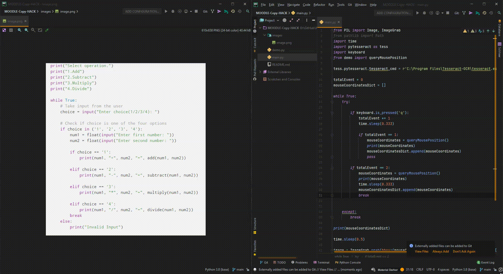

# Image to Text Script
A simple screenshot tool to copy the area you specified, save that area as a new image in your directory, and then OCR model to recognise what it written in that image, convert to a string formatted output, and return to you.

### Below you can find a demo of how the program is actually working:


### Requirements:

|Libraries|
|:--------------------------:|
|pytesseract                       |
|keyboard|
|pathlib|
|ctypes|
|Pillow|
|time|
|os|


### Instructions:
<blockquote>After running the script, in the terminal where you ran you script, locate the cursor where you want to take the first X1 and Y1 coordinates, and press "q" while being in the terminal and take the first coordinates, then it will print out the coordinates in a tuple for you, and expect you to get the second coordinates, X2 and Y2. It is the same step, where after aligning your cursor where you want to end your rectangle, just press the "q" again, and then just wait for the OCR to take the X1, Y1 started, and X2, Y2 ended rectangle piece as a new photo, apply the basic detection process on it, and then return the final text as string format to you through the terminal.</blockquote>

### Run the script:

|Windows|Linux & MacOS|
|--------------------------|:--------------------------|
|```$python main.py```|```$python3 main.py```|

### Folder Structure:

```
Image-to-Text
    │
    └── main.py
    │
    └── demo.py
    │    
    └── images
    │     └── image.png
    └── demo.gif
```

### Article:

Medium - 
https://woosal1337.medium.com/image-to-text-ocr-python-4acd8e48e8ca

Dev.to - 
https://dev.to/woosal/moodle-bypass-copy-the-question-56jk


### Contributors:
<a href="https://www.github.com/woosal1337"></a>
